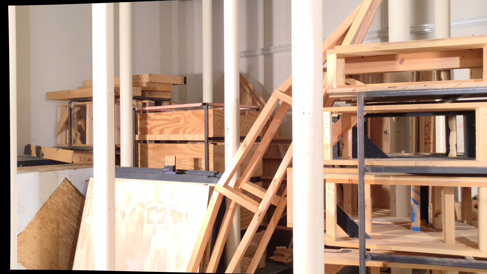

# Disparity Mapping with OpenCV Stereo SGBM

改善点として、奥行きと木箱や柱のディティールの精度を上げる必要があります

## 使用した画像

## 生成した視差マッピング

## 使用したクレート及びライブラリ

### クレート

[opencv crates.io](https://crates.io/crates/opencv)

### ドキュメント

[opencv docs](https://docs.rs/opencv/0.94.2/opencv/index.html)

### 公式サイト

[OpenCV official page](https://opencv.org/)
